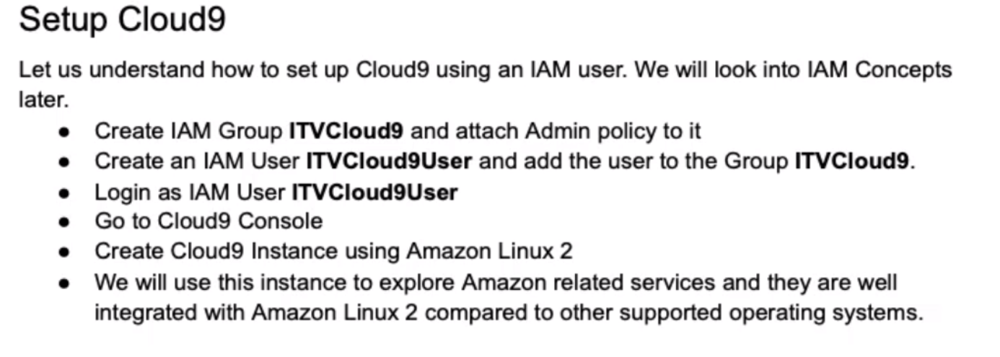

# DE-AWS-udemy-

0. [Configure AWS](#schema0)
1. [Config](#schema1)
2. [Ref](#schemaref)

<hr>
<a name='schema0'></a>

## 0. Configure AWS and jupyter lab

```bash
aws configure
```

```bash
aws configure set aws_session_token ""
```
```bash
jupyter lab
```


<hr>
<a name='schema1'></a>

## 1. Config

1. Install Virtual Env
2. Create Env
3. Install Jupyter Lab
4. Install Boto3
5. Install Cloud9


<hr>
<a name='schema2'></a>

## 2. Cloud9

AWS Cloud9 is a cloud integrated development environment (IDE) that provides a set of tools for writing, running, and debugging code. It is designed especially for developers working on cloud projects, enabling real-time collaboration and providing access to AWS cloud resources directly from the IDE.




<hr>
<a name='schemaref'></a>

REF: https://www.udemy.com/course/data-engineering-using-aws-analytics-services/