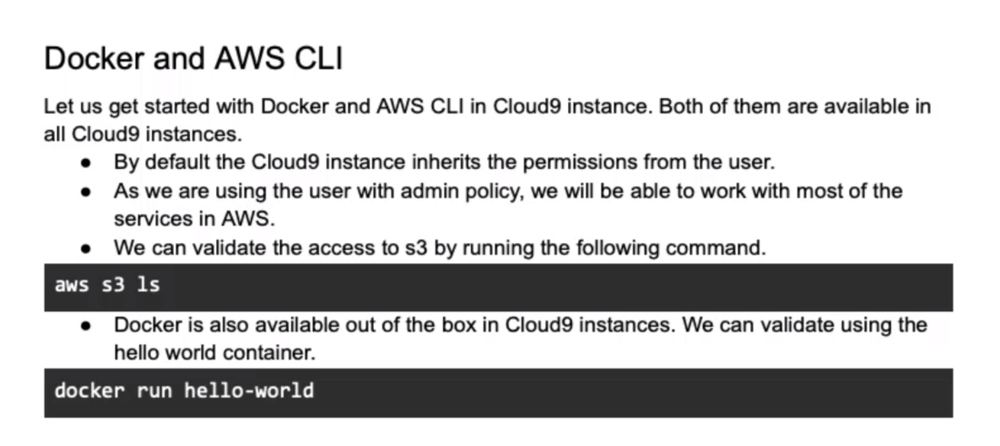

# DE-AWS-udemy-

0. [Configure AWS](#schema0)
1. [Config](#schema1)
2. [Cloud9](#schema2)
3. [Docker and AWS CLI](#schema3)
4. [Cloud9 and EC2](#schema4)
5. [Kafka](#schema5)
2. [Ref](#schemaref)

<hr>
<a name='schema0'></a>

## 0. Configure AWS and jupyter lab

```bash
aws configure
```

```bash
aws configure set aws_session_token ""
```
```bash
jupyter lab
```


<hr>
<a name='schema1'></a>

## 1. Config

1. Install Virtual Env
2. Create Env
3. Install Jupyter Lab
4. Install Boto3
5. Install Cloud9


<hr>
<a name='schema2'></a>

## 2. Cloud9

AWS Cloud9 is a cloud integrated development environment (IDE) that provides a set of tools for writing, running, and debugging code. It is designed especially for developers working on cloud projects, enabling real-time collaboration and providing access to AWS cloud resources directly from the IDE.


<hr>
<a name='schema3'></a>

## 3. Docker and AWS CLI



<hr>
<a name='schema4'></a>

## 4. Cloud9 and EC2


- Configure Http

```bash
sudo systemctl status httpd
```
```bash
sudo systemctl start httpd
```

```bash
telnet localhost 80
```
- Configure Security group EC2
  - edit inbound rules 
    - http, my ip

<hr>
<a name='schema5'></a>

## 5. Kafka

In Apache Kafka, a topic is a category or stream of data that data producers (publishers) can write to and data consumers (subscribers) can read from. Basically, a topic is a communication channel where data is published and consumed.

### **Install Apache Kafka**

https://kafka.apache.org/quickstart

### **Start the ZooKeeper service**
```bash
bin/zookeeper-server-start.sh config/zookeeper.properties
```

### **Start the Kafka broker service**
```bash
bin/kafka-server-start.sh config/server.properties
```

### **Managing Topics using Kafka CLI**

As part of this topic let us see how we can manage Kafka topics using command line.

- List the topics in the Kafka cluster
- Drop the topic, if it exists
- Create the topic using login user prefix and then retail. We will create topic with partitions as 3 and replication factor as 2.
- List the topics to verify whether it is successfully created or not.
- Describe the topic to get the details related to partitions of the topic.

We need to pass zookeeper details to manage topics using `kafka-topics.sh` command.

Here are the commands to validate these on single node cluster for your reference.

- List the topics in the Kafka cluster

```bash
%%sh

kafka/bin/kafka-topics.sh --bootstrap-server localhost:9092 --list

```
- Drop the topic, if it exists
```bash
%%sh

kafka/bin/kafka-topics.sh --bootstrap-server localhost:9092 --delete --topic mi_topic


```

- Create the topic using login user prefix and then retail. We will create topic with partitions as 3 and replication factor as 2.
```bash
%%sh

kafka/bin/kafka-topics.sh --bootstrap-server localhost:9092 --create --topic $(whoami)_retail --partitions 3 --replication-factor 1


```

- List the topics to verify whether it is successfully created or not.
```bash
%%sh

kafka/bin/kafka-topics.sh --bootstrap-server localhost:9092 --list --topic `whoami`_retail

patricia_retail
```

- Describe the topic to get the details related to partitions of the topic.
```bash
%%sh

kafka/bin/kafka-topics.sh --bootstrap-server localhost:9092 --describe --topic `whoami`_retail


Topic: patricia_retail	TopicId: _rDdGN1SSFOKoIwq6ukAaA	PartitionCount: 3	ReplicationFactor: 1Configs: 
	Topic: patricia_retail	Partition: 0	Leader: 0	Replicas: 0	Isr: 0
	Topic: patricia_retail	Partition: 1	Leader: 0	Replicas: 0	Isr: 0
	Topic: patricia_retail	Partition: 2	Leader: 0	Replicas: 0	Isr: 0


```


- Drop the topic, if it exists
```bash
whoami
```

```bash
%%sh

kafka/bin/kafka-topics.sh --bootstrap-server localhost:9092 --delete --topic $(whoami)_retail

```


<hr>
<a name='schemaref'></a>

REF: https://www.udemy.com/course/data-engineering-using-aws-analytics-services/

https://www.udemy.com/course/data-engineering-using-kafka-and-spark-structured-streaming/